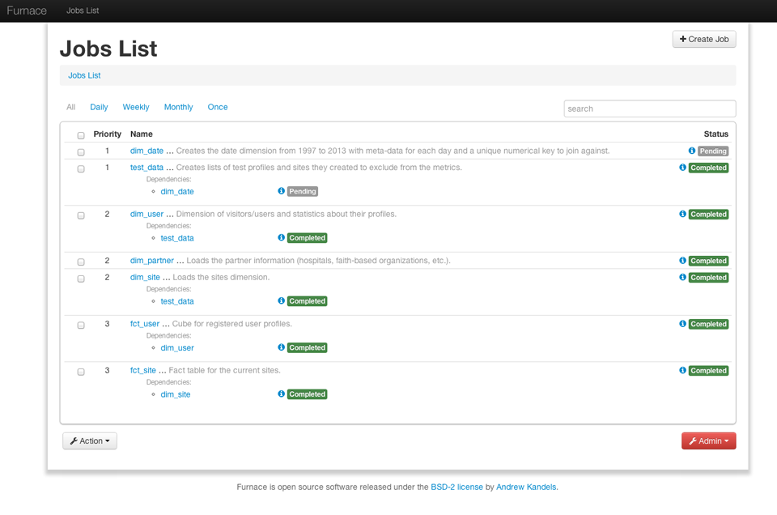
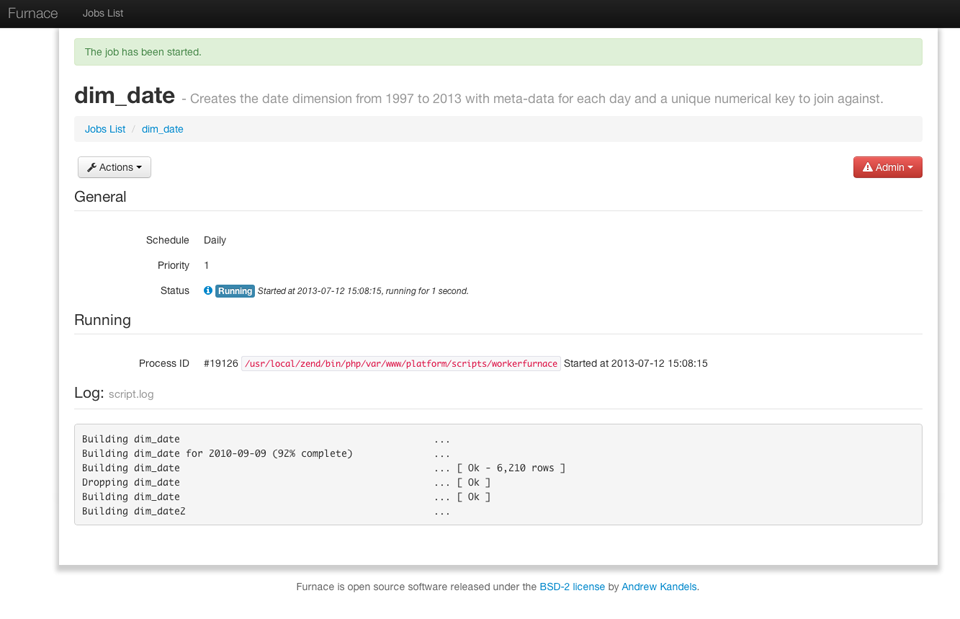
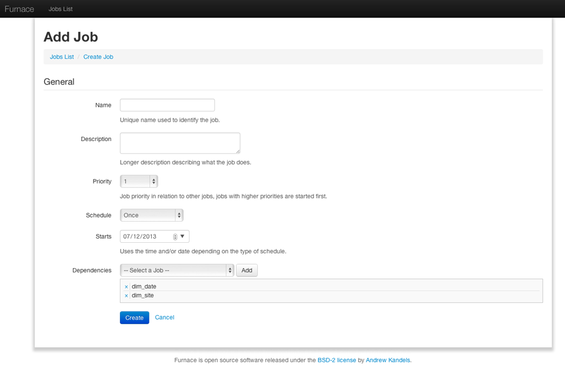
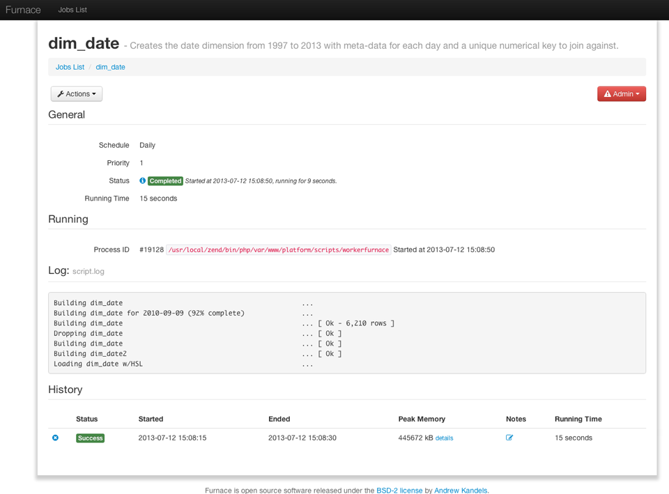

Furnass - Background Job Management Interface for Zend Framework 2
==================================================================

Furnace is Zend Framework 2 module providing an intuitive user interface for
managing background jobs and processing. It handles prioritization, dependencies,
history and event logging, status updates and scheduling.

Features
--------

Furnace supports the following feature set:

* Starting and stopping running jobs
* Tracking job status (queued, pending, started, error, completed, failed)
* History and event logging (with notes)
* Dependency management (don't run job B until job A is completed)
* Scheduling (daily, weekly, monthly)
* CRUD interface for creating, viewing, editing and deleting jobs from the UI
* Search
* Job execution logs and realtime inspection
* Reports: running time trending, errors %, etc.

Message Queues
--------------

Furnace is agnostic to how the jobs are actually run, either synchroneously or
asynchroneously. A common approach is through a message queue such as:

* RabbitMQ
* ActiveMQ
* Gearman
* Zend Job Queue

You need only extend an interface and implement a `run()` method in a new class 
and register it with the ZF2 service manager in order to integrate Furnace into
your application. See the `examples/` directory for code examples on integrating
Furnass with various message queues.

Why?
----

Running background work through systems like cron is often used for:

* Backups
* Generating Reports
* Sending Scheduled Emails
* Cleanup (log deletion, temporary file removal, etc.)

Visibility into the execution of this work is often overlooked. Failure is usually
reported through email without much companion information to help diagnose the problem.
Furnace sits on top of whatever system you already use (cron, etc.) to schedule and 
monitor these jobs for much more information.

Installation
------------

To install Furnance, simply add the composer module to your ZF2 project's composer.json:

    "require": {
        "akandels/furnace": "dev-master"
    ...

Then enable it on your project's configuration:

    'modules' => array(
        'Furnace',
    ...

You can access Furnace through a new route: `http://your-project.org/furnace`

To configure Furnace, add this to your projects configuration (usually: config/module.config.php):

    return array(
        'furnace' => array(
            'jobs' => array(
                'class_template' => 'Project%sJob',
                'class_terminate' => 'ProjectTerminateJob',
            ),
        ),
        ...
        'service_manager' => array(
            'invokables' => array(
                'ProjectMainJob' => 'Path\To\MainJob',
                'ProjectTerminateJob' => 'Path\To\TerminateJob',
            ...

You then need to create and register at least two classes (the Path\To... above).
The class with "Terminate" is used to stop jobs, and the class with "Main" is used
to start them. Each should implement `Furnace\Jobs\JobInterface` and include the 
`run()` method:

    public function run(\Furnace\Entity\Job $job)
    {
        // code to start the job
    }

The `$job` class includes the following methods:

    getSchedule()       // daily, weekly, monthly, once
    getName()           // job name
    getPriority()       // priority
    getDependencies()
    getHistory()
    getPidOf()
    getMessages()
    getLogs()

Automatic Execution
-------------------

If you want automatic execution of jobs, you'll also need to create a
heartbeat call, usually with something like cron:

*/5 * * * * /path/to/application/public/index.php furnace 1>/dev/null

Furnace will then automatically start jobs in a pending status that 
have all of their dependencies met (in order of their priority).
It will continue to start jobs with each heartbeat. 

Furnace will also retry failed jobs at least 3 times (after which a 
manually restart from the UI is required).

Questions, Comments?
--------------------

If you have any feedback, please send it my way. I'm @andrewkandels on Twitter or akandels [at] gmail.com. If you have any ideas for improvements, feel free to send me some pull requests. If you're using it, let me know! Enjoy.

License
-------

Released under the BSD-2 license by Andrew Kandels.

Dependencies
------------

Furnace relies on these excellent libraries (included in your checkout):

* jQuery
* Modernizr
* Twitter Bootstrap
* Font Awesome
* Contain
* ContainMapper
* Zend Framework 2

Furnace uses (but not does include and does not require you to install):

* SASS/Compass
* Google's Closure Compiler
